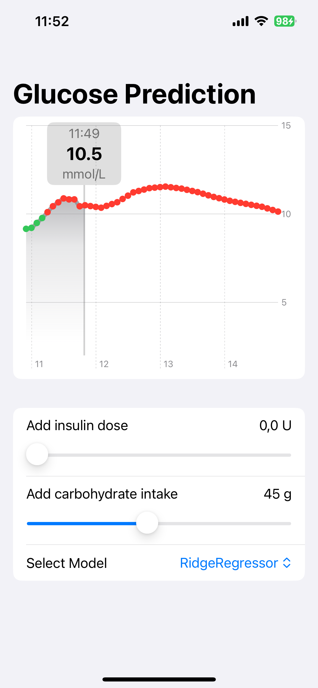

# GlucoProphet

GlucoProphet is an iPhone application for testing various Machine Learning blood glucose prediction models in real-time. 

Model inputs can be adjusted in the UI, to explore and observe how features affect the forecasting outcomes.

|  |  |  |
|--------------------------------------|---------------------------------------|---------------------------------------|


## Citation 

If you found this work helpful, please cite this work: 

[Mobile Software Development Kit for Real Time Multivariate Blood Glucose Prediction](https://ieeexplore.ieee.org/document/10379644)

Thank you!


## Table of Contents

1. [How to Add Custom Models to GlucoProphet](#how-to-add-custom-models-to-glucoprophet)
   1. [Train Model in GluPredKit](#train-model-in-glupredkit)
   2. [Model File Convertion](#model-file-convertion)
   3. [Model Implementation](#model-implementation)
4. [Cautions and Limiations](#cautions-and-limitations)

## How to Add Custom Models to GlucoProphet
In this section we will explain the pipeline on how to add your own custom prediction models into GlucoProphet. First, 
a model must be trained using external libraries like Scikit Learn, PyTorch or Tensorflow. I suggest to use 
[GluPredKit](https://github.com/miriamkw/GluPredKit). Then, the model must be converted
to [Core ML](https://apple.github.io/coremltools/docs-guides/source/overview-coremltools.html). Lastly, some code must
be added in GlucoProphet to integrate the model and make it appear in the dropdown menu in the UI.

### Train Model in GluPredKit
[GluPredKit](https://github.com/miriamkw/GluPredKit) is a tool to facilitate model training and evaluation for blood glucose prediction.
The repository has an extensive documentation as well as a video-tutorial.

### Model File Convertion
After you have trained a model using [GluPredKit](https://github.com/miriamkw/GluPredKit), the trained model must be converted
to [Core ML](https://apple.github.io/coremltools/docs-guides/source/overview-coremltools.html). This can be done using
the following script:
```
import coremltools as ct
import pickle
import tensorflow as tf

prediction_horizon = '180'
models = ['ridge', 'lstm']
config = 'my_config'

for model in models:
    file_name = f'{model}__{config}__{prediction_horizon}'
    file_path = f"data/trained_models/{file_name}.pkl"

    # Load model class
    with open(file_path, 'rb') as file:
        loaded_class = pickle.load(file)

    # Code for converting models trained using Scikit Learn
    if model == 'ridge': 
        model = loaded_class.model.best_estimator_.named_steps['regressor']
        feature_names = loaded_class.model.best_estimator_.feature_names_in_
        mlmodel = ct.converters.sklearn.convert(model,
                                                feature_names)
    
    # Code for converting models trained using Tensorflow or PyTorch
    if model == 'lstm':
        model = tf.keras.models.load_model(loaded_class.model_path,
                                           custom_objects={"Adam": tf.keras.optimizers.legacy.Adam})
        mlmodel = ct.convert(model,
                             source='tensorflow',
                             # source='pytorch',
                             )

    output_mlmodel_file = f'{file_name}.mlpackage'
    mlmodel.save(f"data/trained_models/{output_mlmodel_file}")
```
You have to modify prediction horizon, model names and configuration name to fit your use case.

### Model Implementation

#### Integrate Model
From the previous step, you should now have some `.mlpackage` files in `data/trained_models/` within GluPredKit. Create a new folder within `GlucoProphet/PredictionModels`, and paste the files into the
folder.

#### Implement Model Class
Within the folder `GlucoProphet/PredictionModels`, create a new swift class. This class must implement
`BaseModel`. Here is an example of a sceleton model class:

```
import Foundation

class YourModel: BaseModel {
    let identifier: String
    
    init(identifier: String) {
        self.identifier = identifier
    }
    
    func predict(tempBasal: Double, addedBolus: Double, addedCarbs: Double) -> [BloodGlucoseModel] {
        return []
    }
}
```

Use the existing models in the repository (stored within `GlucoProphet/PredictionModels`) as inspiration to implement your model, to add the correct input feature format, 
and to connect the correct input features from HealthKit.

#### Update UI
Lastly, the UI should be updated with your custom model predictions and added to the dropdown menu in the UI picker.

In `MainViewController.swift`, add you model class initiation: 

```
private let ridge = RidgeRegressor(identifier: "RidgeRegressor")
private let lstm = LSTM(identifier: "LSTM")
// Add your model
private let yourModel = YourModel(identifier: "YourModel")
```
In the function `fetchPredictions`, add your model as an alternative:
```
private func fetchPredictions() {
        if let newestBgSample = self.bgStore.bgSamples.last {
            DispatchQueue.main.async {
                var predictions: [BloodGlucoseModel] = []
                if self.selectedModel == "LSTM" {
                    predictions = self.lstm.predict(tempBasal: self.tempBasal, addedBolus: self.addedBolus, addedCarbs: self.addedCarbs)
                // Add your model
                elif self.selectedModel == "YourModel {
                    predictions = self.yourModel.predict(tempBasal: self.tempBasal, addedBolus: self.addedBolus, addedCarbs: self.addedCarbs)
                } else {
                    predictions = self.ridge.predict(tempBasal: self.tempBasal, addedBolus: self.addedBolus, addedCarbs: self.addedCarbs)
                }
                // ... existing code
            }
        }
    }
```
In `MainView.swift`, add your model to the Picker-menu: 
```
// Add picker menu for different prediction models
Picker("Select Model", selection: $controller.selectedModel) {
    // Add your model to the list below
    ForEach(["RidgeRegressor", "LSTM", "YourModel"], id: \.self) { model in
        Text(model)
    }
}
```

## Cautions and Limitations

- This app is not made for treatment decisions. This app is a proof-of-concept app to test and compare prediction approaches in real-time. 
- This proof-of-concept app does not have properly implemented methods to handle errors like missing input data availability. Bugs and errors leading to app crash may appear.
- Glucose data and other health data is fetched using HealthKit, so real-time syncronization to HealthKit is required.
- Linear interpolation is added between each predicted value so that predictions appear with 5-minute intervals in the UI.


